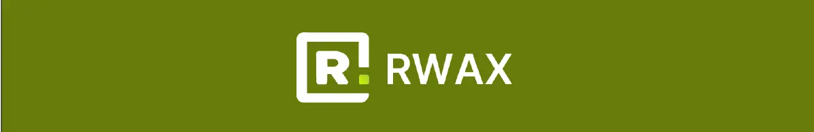

## RWAX brand kit

This repo contains fonts and logos for the RWAX brand.

<!-- Badge row 2 - links and profiles -->

### Logo

| Symbol                                                             | Wordmark                                                               |
| ------------------------------------------------------------------ | ---------------------------------------------------------------------- |
|   |   |
|   |   |
|  |  |

### Brand Colors

##### Avocado Green | #687C0A

##### Yellow Green | #cbfb01

##### White | #FFFFFF

##### Gray Scale | #838383

##### Silver Gray | #B6B6B6

##### Black | #000000

